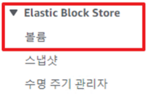
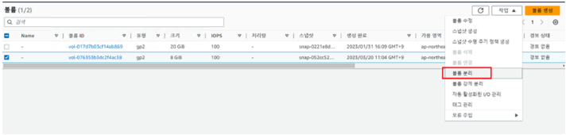
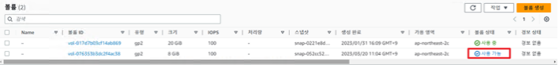
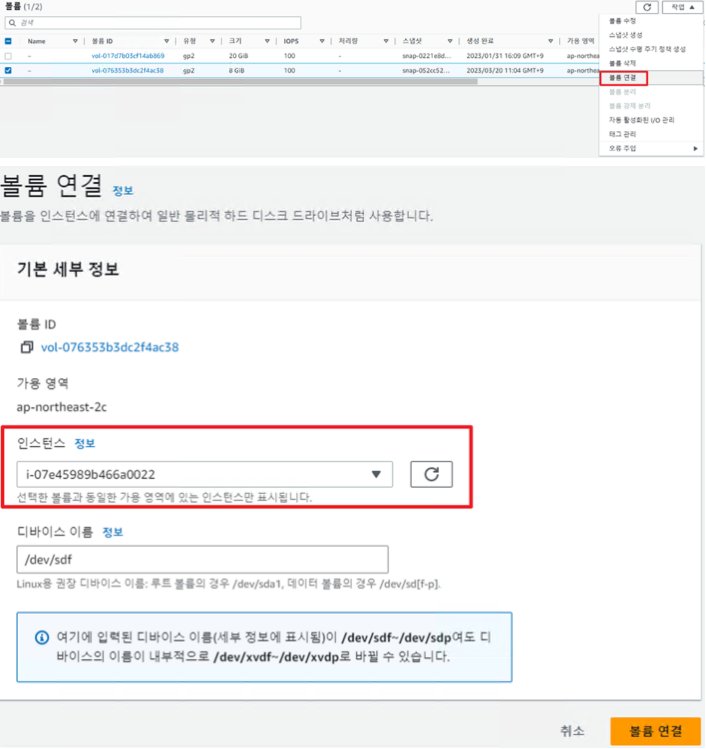
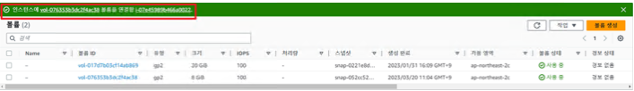

1. 신규 EC2 생성
패스워드 변경을 도와줄 임시 EC2를 생성 합니다.
사양(Type)은 높지 않아도 됩니다.


2. 기존 EC2 볼륨 분리

    우선, 기존 EC2의 Volume을 분리하기 위해 인스턴스 중지를 진행합니다. [3]

    중지가 완료 되었으면 볼륨으로 이동하여 기존 EC2 볼륨 분리를 진행합니다.





분리된 volume의 상태가 사용가능 으로 변경 되었으면 정상 분리가 된 것입니다.





3. 신규 EC2 볼륨 연결 / Mount

분리한 볼륨을 신규 EC2에 연결을 진행 합니다.




인스턴스는 신규 EC2를 선택 합니다.




연결이 완료 되었습니다.


#연결이 완료 되었으면 신규 EC2 서버 내에서 Mount를 진행합니다. 
#fdisk -l

Disk /dev/xvdf: 8 GiB, 8589934592 bytes, 16777216 sectors \
Units: sectors of 1 * 512 = 512 bytes \
Sector size (logical/physical): 512 bytes / 512 bytes \
I/O size (minimum/optimal): 512 bytes / 512 bytes \
Disklabel type: gpt \
Disk identifier: CF6826E8-D9DF-47E9-AEB5-E4D9241880 \
Device       Start      End  Sectors  Size Type \
/dev/xvdf1  227328 16777182 16549855  7.9G Linux filesystem \
/dev/xvdf14   2048    10239     8192    4M BIOS boot \
/dev/xvdf15  10240   227327   217088  106M EFI System \


먼저 장착된 볼륨의 네임을 확인합니다.
/dev/xvdf 군요. 1번파티션이 /(root) 파티션입니다.
마운트를 진행해보죠.
# mkdir /test_ori
# mount /dev/xvdf1 /test_ori
# df -Th
/dev/xvdf1     ext4     7.6G  1.5G  6.1G  20% /test_ori
마운트가 완료 되었습니다.


````
chroot /test_ori
로 접속 하여
root 패스워드 설정 및 변경


그 후 exit 로 원래 환경으로 돌아온 뒤
umount /test_ori

AWS 콘솔 상에서도 기존 Ec2 에 볼륨 장착
부팅 후 확인
````

