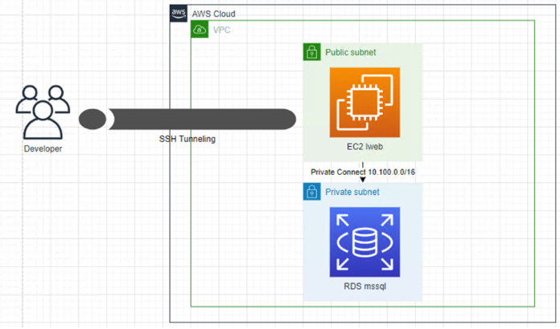
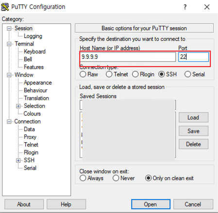
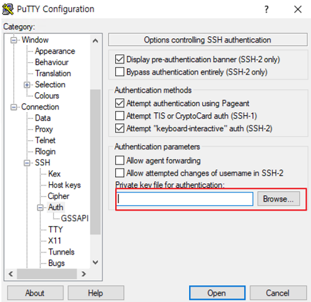
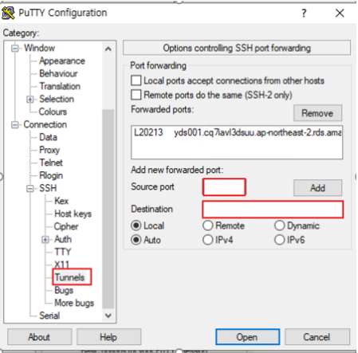
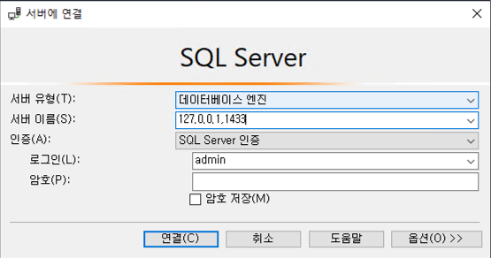

SSH VPN 접속 방법

### SSH Tunneling 이란?

```
-SSH Tunneling 은 프록시와 비슷한 역할을 하며 , 전달 되는 데이터는 모두 암호화 된다.
-Putty 를 이용한 SSH Tunneling 은 반드시 SSH Tunneling 용도 서버에 접속 한 상태에서만 터널링 가능

```




### SSH 접속

ex) AWS 내에 같은 VPC 안에 있는 EC2 리눅스 서버 SSH 접속 후 RDS(mssql) 접속

1. **`SSH 접속 서버 IP 입력 후 원격 포트 입력`**



**`2. ppk 파일 적용`**
Connection -> SSH -> Auth -> Authentication parameters에
Private Key file for authentication 에 변환한 ppk 파일 적용`




`3. Connection -> SSH -> Auth -> Tunnels`

Source port = 접속할 포트 ex 1433
Destination : ip:port 입력 후 Add
ex) AWS mysql 인 경우
yds001.cq7iavl3dsuu.ap-northeast-2.rds.amazonaws.com:1433




**`4. 로컬 PC cmd 창에서 netstat 명령어로 포트 확인**
netstat -ano | findstr "해당포트"`

`**5. 로컬 PC 에서 해당 포트로 접속 확인**
ex) 127.0.0.1,1433`

